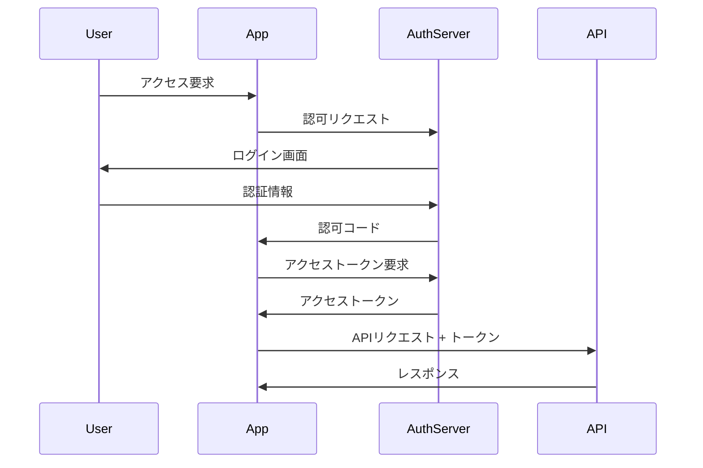

# モダンWebアプリケーションにおけるJWT認証の完全ガイド - 理論から実装まで

## 目次

1. [はじめに](#はじめに)
2. [認証と認可の基礎](#認証と認可の基礎)
3. [JWT（JSON Web Token）の詳細](#jwtjson-web-tokenの詳細)
4. [OAuth 2.0とOpenID Connectの仕組み](#oauth-20とopenid-connectの仕組み)
5. [アーキテクチャ設計](#アーキテクチャ設計)
6. [実装詳細](#実装詳細)
7. [セキュリティベストプラクティス](#セキュリティベストプラクティス)
8. [パフォーマンス最適化](#パフォーマンス最適化)
9. [トラブルシューティング](#トラブルシューティング)
10. [まとめと今後の展望](#まとめと今後の展望)

## はじめに

現代のWebアプリケーション開発において、セキュアな認証システムの実装は避けて通れない課題です。特に、フロントエンドとバックエンドが分離されたSPA（Single Page Application）やモバイルアプリケーションでは、従来のセッションベース認証に代わる新しいアプローチが必要となります。

本記事では、JWT（JSON Web Token）を使用した認証システムの理論的背景から、Rails API + Next.js + GraphQLという実践的な技術スタックでの実装まで、包括的に解説します。

### なぜこの記事を書くのか

多くの開発者が認証システムの実装で躓く理由は、以下のような点にあります：

- 認証と認可の違いが曖昧
- JWTの仕組みを表面的にしか理解していない
- セキュリティリスクを適切に評価できていない
- 実装パターンが断片的で体系化されていない

本記事では、これらの課題を解決し、プロダクションレディな認証システムを構築するための知識を提供します。

## 認証と認可の基礎

### 認証（Authentication）と認可（Authorization）の違い

**認証（Authentication）**
- 「あなたは誰ですか？」という問いに答えるプロセス
- ユーザーの身元を確認する
- 例：ログイン、生体認証、多要素認証

**認可（Authorization）**
- 「あなたは何ができますか？」という問いに答えるプロセス
- 認証されたユーザーのアクセス権限を確認する
- 例：管理者権限、リソースへのアクセス制御

### セッションベース認証 vs トークンベース認証

#### セッションベース認証

```
[Client]                    [Server]
   |                           |
   |------- Login Request ---->|
   |                           | Create Session
   |<------ Session ID --------|  Store in Memory/DB
   |                           |
   |-- Request + Session ID -->|
   |                           | Verify Session
   |<------ Response ----------|
```

**特徴：**
- サーバー側でセッション情報を保持
- セッションIDをCookieで管理
- ステートフル（状態を持つ）

**メリット：**
- 実装がシンプル
- セッション無効化が容易
- 従来のWebアプリケーションに適している

**デメリット：**
- スケーラビリティの問題（セッション共有が必要）
- モバイルアプリとの相性が悪い
- マイクロサービスアーキテクチャに不向き

#### トークンベース認証

```
[Client]                    [Server]
   |                           |
   |------- Login Request ---->|
   |                           | Generate Token
   |<-------- JWT Token ------|
   |                           |
   |-- Request + JWT Token --->|
   |                           | Verify Token
   |<------ Response ----------|
```

**特徴：**
- クライアント側でトークンを保持
- HTTPヘッダーでトークンを送信
- ステートレス（状態を持たない）

**メリット：**
- 優れたスケーラビリティ
- マイクロサービスに適している
- モバイルアプリとの相性が良い

**デメリット：**
- トークンの無効化が複雑
- トークンサイズが大きい
- XSS攻撃のリスク（LocalStorage保存時）

## JWT（JSON Web Token）の詳細

### JWTの構造

JWTは3つの部分から構成され、ピリオド（.）で区切られています：

```
xxxxx.yyyyy.zzzzz
```

1. **Header（ヘッダー）**
2. **Payload（ペイロード）**
3. **Signature（署名）**

#### 1. Header（ヘッダー）

```json
{
  "alg": "HS256",
  "typ": "JWT"
}
```

- `alg`: 署名アルゴリズム（HS256, RS256など）
- `typ`: トークンタイプ（通常は"JWT"）

#### 2. Payload（ペイロード）

```json
{
  "sub": "1234567890",
  "name": "John Doe",
  "email": "john@example.com",
  "iat": 1516239022,
  "exp": 1516242622
}
```

**標準クレーム：**
- `iss` (issuer): 発行者
- `sub` (subject): 主題（通常はユーザーID）
- `aud` (audience): 受信者
- `exp` (expiration time): 有効期限
- `nbf` (not before): 有効開始時刻
- `iat` (issued at): 発行時刻
- `jti` (JWT ID): JWT固有のID

#### 3. Signature（署名）

```
HMACSHA256(
  base64UrlEncode(header) + "." +
  base64UrlEncode(payload),
  secret
)
```

### JWTの生成と検証プロセス

#### 生成プロセス

```ruby
class JsonWebToken
  SECRET_KEY = Rails.application.credentials.secret_key_base

  def self.encode(payload, exp = 24.hours.from_now)
    # ペイロードに有効期限を追加
    payload[:exp] = exp.to_i
    payload[:iat] = Time.now.to_i
    
    # JWTを生成
    JWT.encode(payload, SECRET_KEY, 'HS256')
  end
  
  def self.decode(token)
    # JWTをデコード
    decoded = JWT.decode(token, SECRET_KEY, true, { algorithm: 'HS256' })[0]
    HashWithIndifferentAccess.new(decoded)
  rescue JWT::DecodeError => e
    raise InvalidTokenError, "Invalid token: #{e.message}"
  rescue JWT::ExpiredSignature
    raise TokenExpiredError, "Token has expired"
  rescue JWT::InvalidIatError
    raise InvalidTokenError, "Invalid issued at time"
  end
end
```

#### 検証プロセス

1. **形式検証**: トークンが3つの部分から構成されているか
2. **署名検証**: 署名が正しいか（改ざんされていないか）
3. **有効期限検証**: トークンが期限切れでないか
4. **クレーム検証**: 必要なクレームが含まれているか

### JWTのセキュリティ考慮事項

#### 1. シークレットキーの管理

```ruby
# 悪い例
SECRET_KEY = "my-secret-key"

# 良い例
SECRET_KEY = Rails.application.credentials.secret_key_base
# または
SECRET_KEY = ENV['JWT_SECRET_KEY']
```

#### 2. アルゴリズムの選択

```ruby
# 対称鍵暗号（HS256）- シンプルなケース
JWT.encode(payload, secret, 'HS256')

# 非対称鍵暗号（RS256）- より安全
private_key = OpenSSL::PKey::RSA.new(File.read('private_key.pem'))
JWT.encode(payload, private_key, 'RS256')
```

#### 3. トークンの保存場所

**LocalStorage（非推奨）**
```javascript
// XSS攻撃に脆弱
localStorage.setItem('token', jwt)
```

**HttpOnly Cookie（推奨）**
```javascript
// XSS攻撃から保護
document.cookie = `token=${jwt}; HttpOnly; Secure; SameSite=Strict`
```

**メモリ内保存 + リフレッシュトークン（最も安全）**
```javascript
// アクセストークンはメモリに保存
let accessToken = null

// リフレッシュトークンはHttpOnly Cookieに保存
// アクセストークンの有効期限が短い（15分など）
```

## OAuth 2.0とOpenID Connectの仕組み

### OAuth 2.0の基本概念

OAuth 2.0は認可のためのプロトコルです。主な登場人物：

1. **Resource Owner（リソース所有者）**: エンドユーザー
2. **Client（クライアント）**: アプリケーション
3. **Authorization Server（認可サーバー）**: GoogleやGitHubなど
4. **Resource Server（リソースサーバー）**: APIサーバー

### Authorization Code Flow



### OpenID Connect

OpenID Connectは、OAuth 2.0の上に構築された認証レイヤーです。

**追加される要素：**
- **ID Token**: ユーザー情報を含むJWT
- **UserInfo Endpoint**: ユーザー情報を取得するエンドポイント
- **標準化されたスコープ**: openid, profile, email など

### Google OAuth統合の実装

```typescript
// NextAuth.jsの設定
import GoogleProvider from "next-auth/providers/google"

export const authOptions: NextAuthOptions = {
  providers: [
    GoogleProvider({
      clientId: process.env.GOOGLE_CLIENT_ID!,
      clientSecret: process.env.GOOGLE_CLIENT_SECRET!,
      authorization: {
        params: {
          prompt: "consent",
          access_type: "offline",
          response_type: "code"
        }
      }
    })
  ],
  callbacks: {
    async jwt({ token, account, profile }) {
      // 初回ログイン時
      if (account && profile) {
        token.accessToken = account.access_token
        token.idToken = account.id_token
        token.expiresAt = account.expires_at
        token.refreshToken = account.refresh_token
        token.profile = profile
      }

      // トークンリフレッシュ
      if (Date.now() < (token.expiresAt as number) * 1000) {
        return token
      }

      return refreshAccessToken(token)
    },
    async session({ session, token }) {
      session.accessToken = token.accessToken
      session.idToken = token.idToken
      session.profile = token.profile
      return session
    }
  }
}
```

## アーキテクチャ設計

### システム全体の構成

```
┌─────────────────┐     ┌─────────────────┐     ┌─────────────────┐
│                 │     │                 │     │                 │
│  Next.js App    │────▶│  Rails API      │────▶│  PostgreSQL     │
│  (Frontend)     │     │  (GraphQL)      │     │  (Database)     │
│                 │     │                 │     │                 │
└─────────────────┘     └─────────────────┘     └─────────────────┘
         │                       │
         │                       │
         ▼                       ▼
┌─────────────────┐     ┌─────────────────┐
│                 │     │                 │
│  Google OAuth   │     │  Redis          │
│  (Auth Provider)│     │  (Cache/Queue)  │
│                 │     │                 │
└─────────────────┘     └─────────────────┘
```

### レイヤードアーキテクチャ

#### フロントエンド層

```
src/
├── app/                    # Next.js App Router
│   ├── api/               # API Routes
│   │   └── auth/         # NextAuth.js
│   ├── (auth)/           # 認証が必要なページ
│   └── auth/             # 認証関連ページ
├── components/            # UIコンポーネント
├── contexts/             # Context API
│   └── auth-context.tsx  # 認証コンテキスト
├── hooks/                # カスタムフック
│   └── useAuth.ts       # 認証フック
├── lib/                  # ユーティリティ
│   ├── apollo-client.ts # GraphQLクライアント
│   └── auth.ts          # 認証設定
└── generated/           # GraphQL Code Gen
```

#### バックエンド層

```
app/
├── controllers/
│   └── graphql_controller.rb   # GraphQLエンドポイント
├── graphql/
│   ├── mutations/             # GraphQL Mutations
│   │   ├── google_auth.rb    # Google認証
│   │   └── refresh_token.rb  # トークンリフレッシュ
│   ├── queries/              # GraphQL Queries
│   └── types/                # GraphQL Types
├── models/
│   ├── user.rb              # ユーザーモデル
│   └── refresh_token.rb     # リフレッシュトークン
├── services/
│   ├── auth_service.rb      # 認証サービス
│   └── token_service.rb     # トークン管理
└── lib/
    └── json_web_token.rb    # JWT処理
```

### データフロー設計

#### 1. 初回認証フロー

```ruby
# app/graphql/mutations/google_auth.rb
module Mutations
  class GoogleAuth < BaseMutation
    argument :id_token, String, required: true

    field :user, Types::UserType, null: true
    field :access_token, String, null: true
    field :refresh_token, String, null: true
    field :expires_in, Integer, null: true
    field :errors, [String], null: false

    def resolve(id_token:)
      # 1. Google ID Tokenを検証
      google_user = AuthService.verify_google_token(id_token)
      
      # 2. ユーザーを作成または更新
      user = User.find_or_create_by_google(google_user)
      
      # 3. アクセストークンとリフレッシュトークンを生成
      access_token = TokenService.generate_access_token(user)
      refresh_token = TokenService.generate_refresh_token(user)
      
      # 4. リフレッシュトークンをDBに保存
      user.refresh_tokens.create!(
        token: refresh_token[:jti],
        expires_at: refresh_token[:exp]
      )
      
      {
        user: user,
        access_token: access_token[:token],
        refresh_token: refresh_token[:token],
        expires_in: access_token[:exp] - Time.now.to_i,
        errors: []
      }
    rescue => e
      GraphQL::ExecutionError.new(e.message)
    end
  end
end
```

#### 2. トークンリフレッシュフロー

```ruby
# app/services/token_service.rb
class TokenService
  ACCESS_TOKEN_EXPIRY = 15.minutes
  REFRESH_TOKEN_EXPIRY = 30.days
  
  class << self
    def generate_access_token(user)
      payload = {
        sub: user.id,
        email: user.email,
        exp: ACCESS_TOKEN_EXPIRY.from_now.to_i,
        iat: Time.now.to_i,
        jti: SecureRandom.uuid
      }
      
      {
        token: JWT.encode(payload, secret_key, 'HS256'),
        exp: payload[:exp]
      }
    end
    
    def generate_refresh_token(user)
      payload = {
        sub: user.id,
        exp: REFRESH_TOKEN_EXPIRY.from_now.to_i,
        iat: Time.now.to_i,
        jti: SecureRandom.uuid
      }
      
      {
        token: JWT.encode(payload, refresh_secret_key, 'HS256'),
        exp: payload[:exp],
        jti: payload[:jti]
      }
    end
    
    def refresh_access_token(refresh_token)
      # 1. リフレッシュトークンを検証
      payload = JWT.decode(
        refresh_token, 
        refresh_secret_key, 
        true, 
        { algorithm: 'HS256' }
      )[0]
      
      # 2. DBでトークンの有効性を確認
      stored_token = RefreshToken.find_by(
        token: payload['jti'],
        user_id: payload['sub']
      )
      
      raise InvalidTokenError unless stored_token
      raise TokenExpiredError if stored_token.expired?
      
      # 3. 新しいアクセストークンを生成
      user = User.find(payload['sub'])
      generate_access_token(user)
    end
    
    private
    
    def secret_key
      Rails.application.credentials.jwt_secret_key
    end
    
    def refresh_secret_key
      Rails.application.credentials.jwt_refresh_secret_key
    end
  end
end
```

## 実装詳細

### フロントエンド実装

#### 1. Apollo Clientの設定

```typescript
// lib/apollo-client.ts
import { ApolloClient, InMemoryCache, createHttpLink } from '@apollo/client'
import { setContext } from '@apollo/client/link/context'
import { onError } from '@apollo/client/link/error'
import { TokenRefreshLink } from 'apollo-link-token-refresh'
import jwt_decode from 'jwt-decode'

const httpLink = createHttpLink({
  uri: process.env.NEXT_PUBLIC_GRAPHQL_ENDPOINT
})

const authLink = setContext((_, { headers }) => {
  const token = localStorage.getItem('accessToken')
  
  return {
    headers: {
      ...headers,
      authorization: token ? `Bearer ${token}` : ''
    }
  }
})

const errorLink = onError(({ graphQLErrors, networkError, operation, forward }) => {
  if (graphQLErrors) {
    for (let err of graphQLErrors) {
      switch (err.extensions.code) {
        case 'UNAUTHENTICATED':
          // トークンリフレッシュを試みる
          return forward(operation)
      }
    }
  }
})

const refreshLink = new TokenRefreshLink({
  accessTokenField: 'accessToken',
  isTokenValidOrUndefined: () => {
    const token = localStorage.getItem('accessToken')
    if (!token) return true
    
    try {
      const { exp } = jwt_decode(token)
      return Date.now() < exp * 1000
    } catch {
      return false
    }
  },
  fetchAccessToken: async () => {
    const refreshToken = localStorage.getItem('refreshToken')
    
    const response = await fetch('/api/auth/refresh', {
      method: 'POST',
      headers: { 'Content-Type': 'application/json' },
      body: JSON.stringify({ refreshToken })
    })
    
    return response.json()
  },
  handleFetch: (accessToken) => {
    localStorage.setItem('accessToken', accessToken)
  },
  handleError: (err) => {
    console.error('Token refresh failed:', err)
    localStorage.clear()
    window.location.href = '/auth/signin'
  }
})

export const apolloClient = new ApolloClient({
  link: refreshLink.concat(errorLink.concat(authLink.concat(httpLink))),
  cache: new InMemoryCache()
})
```

#### 2. 認証フックの実装

```typescript
// hooks/useAuth.ts
import { useContext, useCallback, useEffect } from 'react'
import { useRouter } from 'next/navigation'
import { AuthContext } from '@/contexts/auth-context'

interface UseAuthOptions {
  redirectTo?: string
  redirectIfFound?: boolean
}

export function useAuth(options?: UseAuthOptions) {
  const { user, loading, error } = useContext(AuthContext)
  const router = useRouter()
  
  const {
    redirectTo = '/auth/signin',
    redirectIfFound = false
  } = options || {}
  
  useEffect(() => {
    if (!loading) {
      if (!user && !redirectIfFound) {
        router.push(redirectTo)
      }
      if (user && redirectIfFound) {
        router.push(redirectTo)
      }
    }
  }, [user, loading, redirectIfFound, redirectTo, router])
  
  const signOut = useCallback(async () => {
    try {
      // 1. サーバー側でトークンを無効化
      await fetch('/api/auth/signout', { method: 'POST' })
      
      // 2. ローカルストレージをクリア
      localStorage.clear()
      
      // 3. リダイレクト
      router.push('/auth/signin')
    } catch (error) {
      console.error('Sign out error:', error)
    }
  }, [router])
  
  return {
    user,
    loading,
    error,
    signOut,
    isAuthenticated: !!user
  }
}
```

#### 3. 保護されたルートの実装

```typescript
// app/(auth)/layout.tsx
'use client'

import { useAuth } from '@/hooks/useAuth'
import { LoadingSpinner } from '@/components/LoadingSpinner'

export default function AuthLayout({
  children
}: {
  children: React.ReactNode
}) {
  const { loading } = useAuth({ redirectTo: '/auth/signin' })
  
  if (loading) {
    return <LoadingSpinner />
  }
  
  return <>{children}</>
}
```

### バックエンド実装

#### 1. 認証ミドルウェア

```ruby
# app/controllers/concerns/authenticatable.rb
module Authenticatable
  extend ActiveSupport::Concern
  
  included do
    before_action :authenticate_request
  end
  
  private
  
  def authenticate_request
    @current_user = AuthService.authenticate_request(request.headers)
  rescue JWT::DecodeError => e
    render json: { error: 'Invalid token' }, status: :unauthorized
  rescue JWT::ExpiredSignature
    render json: { error: 'Token has expired' }, status: :unauthorized
  end
  
  def current_user
    @current_user
  end
end

# app/services/auth_service.rb
class AuthService
  class << self
    def authenticate_request(headers)
      token = extract_token(headers)
      return nil unless token
      
      decoded = JsonWebToken.decode(token)
      User.find(decoded[:sub])
    end
    
    def verify_google_token(id_token)
      validator = GoogleIDToken::Validator.new
      payload = validator.check(
        id_token,
        Rails.application.credentials.google_client_id,
        Rails.application.credentials.google_client_id
      )
      
      raise InvalidTokenError, 'Invalid Google ID token' unless payload
      
      {
        google_id: payload['sub'],
        email: payload['email'],
        name: payload['name'],
        picture: payload['picture'],
        email_verified: payload['email_verified']
      }
    end
    
    private
    
    def extract_token(headers)
      return nil unless headers['Authorization'].present?
      
      headers['Authorization'].split(' ').last
    end
  end
end
```

#### 2. GraphQLコンテキスト設定

```ruby
# app/controllers/graphql_controller.rb
class GraphqlController < ApplicationController
  skip_before_action :verify_authenticity_token
  
  def execute
    variables = prepare_variables(params[:variables])
    query = params[:query]
    operation_name = params[:operationName]
    
    context = {
      current_user: current_user,
      request: request
    }
    
    result = TodoApiSchema.execute(
      query,
      variables: variables,
      context: context,
      operation_name: operation_name
    )
    
    render json: result
  rescue StandardError => e
    raise e unless Rails.env.development?
    handle_error_in_development(e)
  end
  
  private
  
  def current_user
    @current_user ||= AuthService.authenticate_request(request.headers)
  end
  
  def prepare_variables(variables_param)
    case variables_param
    when String
      variables_param.present? ? JSON.parse(variables_param) || {} : {}
    when Hash
      variables_param
    when ActionController::Parameters
      variables_param.to_unsafe_hash
    when nil
      {}
    else
      raise ArgumentError, "Unexpected parameter: #{variables_param}"
    end
  end
  
  def handle_error_in_development(e)
    logger.error e.message
    logger.error e.backtrace.join("\n")
    
    render json: {
      errors: [{ message: e.message, backtrace: e.backtrace }],
      data: {}
    }, status: 500
  end
end
```

#### 3. GraphQL認証ヘルパー

```ruby
# app/graphql/types/base_object.rb
module Types
  class BaseObject < GraphQL::Schema::Object
    field_class Types::BaseField
    
    def current_user
      context[:current_user]
    end
    
    def authenticate!
      raise GraphQL::ExecutionError.new(
        "You need to authenticate to perform this action",
        extensions: { code: 'UNAUTHENTICATED' }
      ) unless current_user
    end
  end
end

# app/graphql/mutations/base_mutation.rb
module Mutations
  class BaseMutation < GraphQL::Schema::RelayClassicMutation
    argument_class Types::BaseArgument
    field_class Types::BaseField
    input_object_class Types::BaseInputObject
    object_class Types::BaseObject
    
    def current_user
      context[:current_user]
    end
    
    def authenticate!
      raise GraphQL::ExecutionError.new(
        "You need to authenticate to perform this action",
        extensions: { code: 'UNAUTHENTICATED' }
      ) unless current_user
    end
    
    def authorize!(record, action)
      policy = "#{record.class}Policy".constantize.new(current_user, record)
      
      unless policy.send("#{action}?")
        raise GraphQL::ExecutionError.new(
          "You are not authorized to perform this action",
          extensions: { code: 'FORBIDDEN' }
        )
      end
    end
  end
end
```

## セキュリティベストプラクティス

### 1. トークンの保存戦略

#### アプローチ1: HttpOnly Cookie + CSRF Protection

```typescript
// pages/api/auth/[...nextauth].ts
export const authOptions: NextAuthOptions = {
  // ...
  cookies: {
    sessionToken: {
      name: `__Secure-next-auth.session-token`,
      options: {
        httpOnly: true,
        sameSite: 'lax',
        path: '/',
        secure: true
      }
    }
  }
}

// Rails側のCSRF設定
class ApplicationController < ActionController::API
  include ActionController::Cookies
  include ActionController::RequestForgeryProtection
  
  protect_from_forgery with: :exception
  
  before_action :set_csrf_cookie
  
  private
  
  def set_csrf_cookie
    cookies['CSRF-TOKEN'] = {
      value: form_authenticity_token,
      secure: Rails.env.production?,
      same_site: :strict
    }
  end
end
```

#### アプローチ2: メモリストレージ + リフレッシュトークン

```typescript
// lib/auth-store.ts
class AuthStore {
  private accessToken: string | null = null
  private refreshTimer: NodeJS.Timeout | null = null
  
  setAccessToken(token: string, expiresIn: number) {
    this.accessToken = token
    
    // 有効期限の5分前にリフレッシュ
    const refreshTime = (expiresIn - 300) * 1000
    
    if (this.refreshTimer) {
      clearTimeout(this.refreshTimer)
    }
    
    this.refreshTimer = setTimeout(() => {
      this.refreshAccessToken()
    }, refreshTime)
  }
  
  getAccessToken() {
    return this.accessToken
  }
  
  async refreshAccessToken() {
    try {
      const response = await fetch('/api/auth/refresh', {
        method: 'POST',
        credentials: 'include' // HttpOnly Cookieからリフレッシュトークンを送信
      })
      
      const { accessToken, expiresIn } = await response.json()
      this.setAccessToken(accessToken, expiresIn)
    } catch (error) {
      // リフレッシュ失敗時はログイン画面へ
      window.location.href = '/auth/signin'
    }
  }
  
  clear() {
    this.accessToken = null
    if (this.refreshTimer) {
      clearTimeout(this.refreshTimer)
    }
  }
}

export const authStore = new AuthStore()
```

### 2. Rate Limiting

```ruby
# Gemfile
gem 'rack-attack'

# config/initializers/rack_attack.rb
class Rack::Attack
  # ログイン試行の制限
  throttle('login/ip', limit: 5, period: 20.seconds) do |req|
    if req.path == '/graphql' && req.post? && 
       req.params.dig('query')&.include?('googleAuth')
      req.ip
    end
  end
  
  # API全体のレート制限
  throttle('api/ip', limit: 300, period: 5.minutes) do |req|
    req.ip if req.path.start_with?('/graphql')
  end
  
  # トークンリフレッシュの制限
  throttle('refresh/ip', limit: 10, period: 1.hour) do |req|
    if req.path == '/graphql' && req.post? && 
       req.params.dig('query')&.include?('refreshToken')
      req.ip
    end
  end
end

# カスタムレスポンス
Rack::Attack.throttled_responder = lambda do |request|
  match_data = request.env['rack.attack.match_data']
  now = match_data[:epoch_time]
  
  headers = {
    'RateLimit-Limit' => match_data[:limit].to_s,
    'RateLimit-Remaining' => '0',
    'RateLimit-Reset' => (now + (match_data[:period] - now % match_data[:period])).to_s
  }
  
  [429, headers, ["Too Many Requests\n"]]
end
```

### 3. セキュリティヘッダー

```ruby
# config/application.rb
config.middleware.use Rack::Protection::RemoteReferrer
config.middleware.use Rack::Protection::StrictTransport

# app/controllers/application_controller.rb
class ApplicationController < ActionController::API
  after_action :set_security_headers
  
  private
  
  def set_security_headers
    response.headers['X-Content-Type-Options'] = 'nosniff'
    response.headers['X-Frame-Options'] = 'DENY'
    response.headers['X-XSS-Protection'] = '1; mode=block'
    response.headers['Referrer-Policy'] = 'strict-origin-when-cross-origin'
    response.headers['Permissions-Policy'] = 'geolocation=(), microphone=(), camera=()'
    
    if Rails.env.production?
      response.headers['Strict-Transport-Security'] = 'max-age=31536000; includeSubDomains'
    end
  end
end
```

### 4. 入力検証とサニタイゼーション

```ruby
# app/graphql/types/base_input_object.rb
module Types
  class BaseInputObject < GraphQL::Schema::InputObject
    argument_class Types::BaseArgument
    
    # 全ての入力に対する共通バリデーション
    def prepare
      self.to_h.each do |key, value|
        if value.is_a?(String)
          # XSS対策: HTMLタグを除去
          self[key] = ActionController::Base.helpers.sanitize(value, tags: [])
          
          # SQLインジェクション対策は ActiveRecord が自動的に行う
        end
      end
      
      super
    end
  end
end

# 個別のバリデーション例
module Types
  class CreateTodoInputType < BaseInputObject
    argument :title, String, required: true
    argument :description, String, required: false
    
    def prepare
      # タイトルの長さ制限
      if title.length > 255
        raise GraphQL::ExecutionError, "Title is too long (maximum is 255 characters)"
      end
      
      # 説明の長さ制限
      if description && description.length > 1000
        raise GraphQL::ExecutionError, "Description is too long (maximum is 1000 characters)"
      end
      
      super
    end
  end
end
```

### 5. トークンブラックリスト

```ruby
# app/models/token_blacklist.rb
class TokenBlacklist < ApplicationRecord
  validates :jti, presence: true, uniqueness: true
  validates :exp, presence: true
  
  # 期限切れのトークンを定期的に削除
  scope :expired, -> { where('exp < ?', Time.now.to_i) }
  
  def self.blacklisted?(jti)
    exists?(jti: jti)
  end
  
  def self.add(token)
    decoded = JWT.decode(token, nil, false)[0]
    create!(
      jti: decoded['jti'],
      exp: decoded['exp']
    )
  end
  
  def self.cleanup!
    expired.destroy_all
  end
end

# app/jobs/token_cleanup_job.rb
class TokenCleanupJob < ApplicationJob
  queue_as :low
  
  def perform
    TokenBlacklist.cleanup!
    RefreshToken.expired.destroy_all
  end
end

# config/sidekiq.yml
:schedule:
  token_cleanup:
    every: 1d
    class: TokenCleanupJob
```

## パフォーマンス最適化

### 1. トークンキャッシング

```ruby
# app/services/token_cache_service.rb
class TokenCacheService
  CACHE_PREFIX = 'jwt:user:'
  CACHE_EXPIRY = 5.minutes
  
  class << self
    def get(user_id)
      Rails.cache.read("#{CACHE_PREFIX}#{user_id}")
    end
    
    def set(user_id, token_data)
      Rails.cache.write(
        "#{CACHE_PREFIX}#{user_id}",
        token_data,
        expires_in: CACHE_EXPIRY
      )
    end
    
    def invalidate(user_id)
      Rails.cache.delete("#{CACHE_PREFIX}#{user_id}")
    end
    
    def verify_cached_token(token)
      # JWTのペイロードだけをデコード（署名検証なし）
      payload = JWT.decode(token, nil, false)[0]
      
      # キャッシュから取得
      cached_data = get(payload['sub'])
      return nil unless cached_data
      
      # JTIが一致するか確認
      return cached_data if cached_data[:jti] == payload['jti']
      
      nil
    rescue JWT::DecodeError
      nil
    end
  end
end

# 使用例
class GraphqlController < ApplicationController
  def current_user
    @current_user ||= begin
      token = extract_token_from_header
      return nil unless token
      
      # キャッシュをチェック
      cached_data = TokenCacheService.verify_cached_token(token)
      if cached_data
        return User.find(cached_data[:user_id])
      end
      
      # キャッシュミスの場合は通常の検証
      decoded = JsonWebToken.decode(token)
      user = User.find(decoded[:sub])
      
      # キャッシュに保存
      TokenCacheService.set(user.id, {
        jti: decoded[:jti],
        user_id: user.id,
        exp: decoded[:exp]
      })
      
      user
    end
  end
end
```

### 2. GraphQLクエリの最適化

```ruby
# app/graphql/types/query_type.rb
module Types
  class QueryType < Types::BaseObject
    field :todos, [Types::TodoType], null: false do
      argument :status, String, required: false
      argument :limit, Integer, required: false, default_value: 20
      argument :offset, Integer, required: false, default_value: 0
    end
    
    def todos(status: nil, limit:, offset:)
      authenticate!
      
      # N+1問題を回避
      scope = current_user.todos.includes(:tags, :assignees)
      
      # フィルタリング
      scope = scope.where(status: status) if status.present?
      
      # ページネーション
      scope.limit(limit).offset(offset)
    end
  end
end

# バッチローディングの実装
class TodoApiSchema < GraphQL::Schema
  use GraphQL::Dataloader
  
  def self.resolve_type(type, obj, ctx)
    type
  end
end

# app/graphql/sources/user_source.rb
class Sources::UserSource < GraphQL::Dataloader::Source
  def fetch(user_ids)
    User.where(id: user_ids).index_by(&:id)
  end
end
```

### 3. 接続プーリング

```yaml
# config/database.yml
production:
  adapter: postgresql
  pool: <%= ENV.fetch("RAILS_MAX_THREADS") { 5 } %>
  timeout: 5000
  # 接続プールの設定
  checkout_timeout: 5
  reaping_frequency: 10
  # 接続の再利用
  idle_timeout: 300
```

## トラブルシューティング

### よくある問題と解決策

#### 1. CORS関連のエラー

**問題**: `Access to fetch at 'http://localhost:3001/graphql' from origin 'http://localhost:3000' has been blocked by CORS policy`

**解決策**:
```ruby
# config/initializers/cors.rb
Rails.application.config.middleware.insert_before 0, Rack::Cors do
  allow do
    origins ENV.fetch('FRONTEND_URL', 'http://localhost:3000')
    
    resource '*',
      headers: :any,
      methods: [:get, :post, :put, :patch, :delete, :options, :head],
      credentials: true,
      max_age: 86400
  end
end
```

#### 2. 環境変数が読み込まれない

**問題**: `GoogleAuth: Client ID from ENV:` が空

**解決策**:
```ruby
# Gemfile
group :development, :test do
  gem 'dotenv-rails'
end

# .env
GOOGLE_CLIENT_ID=your-client-id
JWT_SECRET_KEY=your-secret-key
```

#### 3. トークンの有効期限エラー

**問題**: `JWT::ExpiredSignature`

**解決策**:
```typescript
// フロントエンドでの自動リフレッシュ実装
const refreshToken = async () => {
  try {
    const response = await fetch('/api/auth/refresh', {
      method: 'POST',
      headers: { 'Content-Type': 'application/json' },
      body: JSON.stringify({
        refreshToken: localStorage.getItem('refreshToken')
      })
    })
    
    if (!response.ok) throw new Error('Refresh failed')
    
    const { accessToken, expiresIn } = await response.json()
    localStorage.setItem('accessToken', accessToken)
    
    // 次回のリフレッシュをスケジュール
    scheduleTokenRefresh(expiresIn)
  } catch (error) {
    // ログイン画面へリダイレクト
    window.location.href = '/auth/signin'
  }
}
```

#### 4. メモリリーク

**問題**: Next.jsアプリでメモリ使用量が増加し続ける

**解決策**:
```typescript
// コンポーネントのクリーンアップ
useEffect(() => {
  const timer = setInterval(refreshToken, 300000) // 5分ごと
  
  return () => {
    clearInterval(timer) // クリーンアップ
  }
}, [])
```

### デバッグツール

#### 1. JWT.ioでのトークン検証

```bash
# トークンをデコードして内容を確認
curl -X POST https://jwt.io/api/decode \
  -H "Content-Type: application/json" \
  -d '{"token": "your.jwt.token"}'
```

#### 2. GraphQL Playground

```ruby
# 開発環境でのみ有効化
if Rails.env.development?
  mount GraphiQL::Rails::Engine, at: "/graphiql", graphql_path: "/graphql"
end
```

#### 3. ロギング

```ruby
# config/initializers/lograge.rb
Rails.application.configure do
  config.lograge.enabled = true
  config.lograge.base_controller_class = 'ActionController::API'
  config.lograge.custom_options = lambda do |event|
    {
      user_id: event.payload[:current_user]&.id,
      request_id: event.payload[:request_id],
      graphql_operation: event.payload[:graphql_operation]
    }
  end
end
```

## まとめと今後の展望

### 実装のポイント

1. **セキュリティファースト**: トークンの保存場所、有効期限、署名アルゴリズムの選択は慎重に
2. **UXの考慮**: 自動リフレッシュ、適切なエラーハンドリング
3. **スケーラビリティ**: ステートレスな設計、キャッシング戦略
4. **監視と運用**: ログ、メトリクス、エラートラッキング

### 今後の改善点

1. **WebAuthn対応**: パスワードレス認証への移行
2. **マルチファクタ認証**: TOTP、SMS認証の追加
3. **セッション管理**: デバイス別セッション、ログイン履歴
4. **権限管理の高度化**: RBAC、ABAC の実装

### さらなる学習リソース

- [OAuth 2.0 Security Best Current Practice](https://datatracker.ietf.org/doc/html/draft-ietf-oauth-security-topics)
- [JWT Best Practices](https://datatracker.ietf.org/doc/html/rfc8725)
- [OWASP Authentication Cheat Sheet](https://cheatsheetseries.owasp.org/cheatsheets/Authentication_Cheat_Sheet.html)

本記事で紹介した実装パターンは、プロダクション環境での使用を想定していますが、セキュリティ要件は組織やサービスによって異なります。実装時は必ず自組織のセキュリティポリシーに従い、定期的なセキュリティ監査を実施してください。

---

*この記事は2024年の最新のベストプラクティスに基づいて書かれています。技術の進化に伴い、推奨される実装方法は変わる可能性があります。*